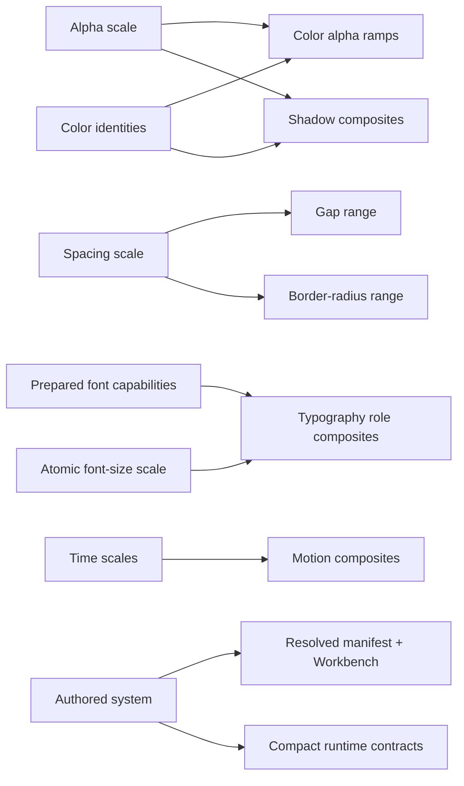

# TFS Founder Board

This is the small ownership surface for Three Forma Styli. It records product
grammar and public boundaries; implementation details remain authoritative in
types, validators, generated evidence, and tests.

## Product thesis

TFS turns a small set of deliberate design decisions into a sophisticated,
portable design-system package. It fixes a coherent grammar, derives repetitive
facts, validates authored intent, and emits framework-neutral CSS, compact typed
contracts, design-tool interchange, and visual evidence. It does not understand
application components such as Button or Chip.

The authoring promise is progressive complexity:

1. sensible defaults are usable immediately;
2. common systems require only their design decisions;
3. derivation helpers remove repetition but never hide resolved truth;
4. advanced capabilities appear at the project boundary that needs them;
5. invalid or ambiguous intent fails rather than being silently repaired.

## Universal grammar

| Term       | Meaning                                            | Example                    |
| ---------- | -------------------------------------------------- | -------------------------- |
| Family     | A higher-level design concern                      | typography                 |
| Domain     | One kind of token or decision within a family      | font size, role, or weight |
| Identity   | A stable authored name inside a domain             | `pri`, `heading`, `hover`  |
| Reference  | One domain deliberately consuming another identity | gap referencing spacing    |
| Scale      | Ordered atomic values available simultaneously     | `--a-*`, `--fs-*`          |
| Range      | Ordered semantic choices owned by one identity     | heading sizes              |
| Ramp       | A resulting progression, usually derived           | `--clr-pri-a-*`            |
| Composite  | Several coupled values applied together            | typography size or shadow  |
| Variant    | An unordered categorical alternative               | `emphatic`, `italic`       |
| Group      | Project-authored taxonomy over identities          | Scatter network colors     |
| Axis       | One independently activatable condition            | theme or size              |
| Mode       | One selectable value along an axis                 | dark, light, small         |
| Constraint | An authored validity policy                        | minimum luminance delta    |
| Contract   | A generated consumer-facing capability             | tokens or typography       |

The grammar is fixed. Domain identities, project groups, numerical values,
composites, axes, and modes remain authored vocabulary.

## Capability matrix

| Family / domain      |           Scale |             Range | Composite | Variant |            Groups |                     Axes |                References |
| -------------------- | --------------: | ----------------: | --------: | ------: | ----------------: | -----------------------: | ------------------------: |
| Alpha                |             yes |                no |        no |      no |   later if needed |                       no |    source for color ramps |
| Color                |              no |                no |        no |      no |               yes |                    theme |            consumes Alpha |
| Spacing              |             yes |                no |        no |      no | not yet justified |                     size |     source for gap/radius |
| Gap                  |              no |               yes |        no |      no | not yet justified |             follows size |          consumes spacing |
| Border radius        |              no |               yes |        no |      no | not yet justified |             follows size |          consumes spacing |
| Border width         | scale or scalar |                no |        no |      no | not yet justified |                 optional |                      none |
| Typography/font size |             yes |                no |        no |      no | not yet justified |                     size |          source for roles |
| Typography/role      |              no |               yes |       yes |     yes | not yet justified |         sparse overrides | consumes font size + font |
| Time                 |             yes |                no |        no |      no | not yet justified |                       no |         source for motion |
| Motion               |              no | ranges may emerge |       yes |     yes | not yet justified |   environment conditions |             consumes time |
| Shadow               |              no |               yes |       yes |      no | not yet justified | follows color references |    consumes color + alpha |

“Not yet justified” is deliberate. TFS implements generic grouping only where a
real authoring case establishes the grouping level; it does not expose speculative
controls merely because the grammar could be copied.

## Dependency graph

## Ratified v0.5 contracts

### Alpha

- Every scale uses `min / lo-x / lo / hi / hi-x / max`; `non: 0` is compiler-owned.
- The six active values strictly increase and `max < 1`.
- The default scale emits `--a-*`; other scales emit `--a-{identity}-*`.
- Color consumes one selected scale and derives `--clr-{identity}-a-*`.
- `deriveAlphaScale({ distribution: "linear", ... })` is authoring sugar only.

### Typography

- Atomic font size remains `--fs-min` plus `--fs-1…n`.
- Each role owns the fixed size range `min / s / base / l / max`.
- `base` is required and unsuffixed. Sparse ranges are controlled: `s` requires
  `min`; `l` requires `max`.
- Weight is role-local. A role uses either one scalar weight or a sparse,
  increasing `min / lo / hi / max` range whose endpoints are actual endpoints.
- Every resolved size has a final weight; omitted size weights inherit the role
  default.
- Variants are categorical and cannot change font family or font size.
- Resolution order is role defaults → size → variant → explicit style/weight.
- Physical style/weight/features/axes are checked against prepared font facts.

### Groups

- Groups contain domain `identities`, not arbitrary token strings.
- Color groups currently accept an explicit identity tuple or a prefix matcher.
- Matching resolves at build time to literal, typed tuples.
- TFS attaches no meaning to project group identities.

### Runtime themes

- Runtime theme generation is a project consumer capability, not palette data.
- Runtime and native-color generated contracts are schema version 2; they use
  `colorIdentities`, and preserve `non` as the literal zero boundary.
- `colors.luminance` owns the reusable OKLCH-L separation constraint.
- `project.runtime.colorThemes` owns the exact accepted runtime color selection.
- Generated browser contracts remain dependency-light and emit native OKLCH.
- “Luminance” is the product term; diagnostics state that the metric is OKLCH L,
  not WCAG relative luminance or a contrast ratio.

### Generated public surface

- `./tokens` is the compact catalogue: identity tuples, project groups, exact
  CSS-variable helpers, and complete color-ramp binding.
- `./typography` is the semantic selection contract and class resolver.
- detailed resolved source, diagnostics, and derivation evidence belong in the
  manifest and Workbench, not ordinary application imports.
- generated runtime modules are deterministic, dependency-free ESM plus `.d.ts`.
- core's public OKLCH type is structural and does not require consumers to install
  Culori declarations.
- framework Text components remain application-owned.

## Package boundaries

| Package          | Owns                                                       | Must not own                                        |
| ---------------- | ---------------------------------------------------------- | --------------------------------------------------- |
| `core`           | grammar, validation, IR, CSS/runtime transforms            | filesystem orchestration or interactive prompts     |
| `compiler`       | projects, fonts, output planning, atomic builds, contracts | application semantics                               |
| `cli`            | human command surface                                      | compiler business logic                             |
| `themes`         | inspectable starter opinions                               | hidden core defaults                                |
| Workbench source | visual review UI compiled into review output               | framework runtime dependencies in consumer packages |

## Workflow contract

| Command                    | Purpose                                           | Expected environment         |
| -------------------------- | ------------------------------------------------- | ---------------------------- |
| `tfs build`                | deterministic compile/generate                    | explicit authoring operation |
| `tfs check`                | reject drift in committed output                  | ordinary CI, no writes       |
| `tfs review serve`         | local visual and diagnostic review                | author workstation           |
| repository `check`         | format, build, unit/type, package-boundary checks | every PR                     |
| repository `check:release` | packed packages + ecosystem fixtures              | release gate                 |

FontTools belongs to generation and dedicated generated-drift verification, not
every application typecheck. Next.js and Svelte fixtures are release evidence,
not dependencies of generated consumer packages.

## Deliberately open after the first v0.5 foundation

- The fully generic multi-axis source model and collision-resolution syntax is
  ratified in direction but must not be faked through today’s legacy category IR.
- Formal ordered-range grammar for Motion and Shadow remains a separate domain
  audit. v0.5 uses the ratified `composites` name but preserves their existing
  author-named variants and review ordering rather than inventing new positions.
- Runtime theme payload policy supports exact input today. Partial payloads need
  an explicit inheritance source and are not silently filled.
- Grouping levels outside Color require real authoring cases before public APIs.
- A future WCAG diagnostic must coexist with—not rename or replace—the OKLCH-L
  luminance-delta model.
- Figma plugin work is decoupled from the v0.5 runtime/type foundation.

The preserved prototype lives on `codex/figma-plugin-wip` in the sibling
`tfs-figma-wip` worktree. It is explicitly dormant and does not participate in
v0.5 builds, package graphs, or release gates.

The current evidence and recommended decision order for the remaining mature
domains is recorded in [the v0.5 domain audit](./v05-domain-audit.md). It is a
decision surface, not a second implementation source of truth.

## Review map

Morning review should inspect, in this order:

1. `examples/project/tfs.config.ts` — the complete authored input.
2. `examples/project/generated/runtime/tokens.d.ts` — the compact token API.
3. `examples/project/generated/runtime/typography.d.ts` — consumer selection grammar.
4. `examples/project/generated/review/index.html` — visual Workbench.
5. `examples/project/generated/build.manifest.json` — exact generated ownership.
6. `docs/v05-migration.md` — how an existing project adopts this without guessing.

No package should be published and no production consumer should be migrated
until this review surface and the full release gate pass.
