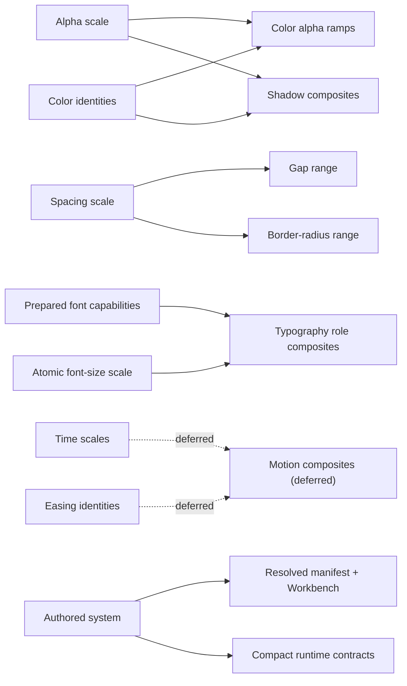

# TFS Founder Board

This is the small ownership surface for Three Forma Styli. It records product
grammar and public boundaries. Ratified contracts describe the intended product;
types, validators, generated evidence, and tests show what is implemented today.
An implementation gap does not reopen a ratified verdict.

## Overhaul milestones

Ratified workflow clarification on 2026-09-09. The current milestone is **1:
blueprint and ratification**.

1. **Plan and ratify the blueprint.** Settle the major domain grammars, authoring
   and consumer experience, cross-domain relationships, and output boundaries.
   Explicitly defer anything outside this overhaul. Record accepted decisions
   separately from proposals and existing implementation evidence.
2. **Strategise and triage the work.** Review the codebase against that blueprint
   with the founder, including architecture, package ownership, code hygiene,
   obsolete code, migration needs, and dependencies between changes. Agree on
   an implementation runbook with bounded increments, review surfaces, and
   verification criteria before development begins.
3. **Implement in reviewable increments.** Work through the agreed runbook,
   explaining each change against its review baseline and presenting the
   relevant code and generated behaviour for review.

Ratifying one domain does not start its implementation while the broader
blueprint workshop is still underway. Moving between milestones is a deliberate,
agreed transition; a request to proceed within the workshop continues that
milestone. Read-only code inspection and decision-document updates support the
blueprint, but adapting source, building Workbench controls, and changing
generated contracts belong to implementation.

Time and Easing authoring contracts are ratified. Shadow's representative mock
and consumer boundary are also ratified; its domain workshop is complete.
Implementation of these overhaul contracts remains pending. Motion composites
are explicitly deferred. The remaining domain mocks and cross-domain decisions
still need review or explicit deferral. A coded Time/Easing preview is not a
prerequisite for those discussions.
This clarification supersedes earlier suggestions to implement the foundations
or adapt the inherited Motion composites before continuing the workshop.

The [workshop progress list](./v05-workshop-progress.md) tracks current readiness
and the recommended review sequence. Keep a compact progress line visible in
workshop replies and update the list when a decision changes. This Board remains
the authority for ratified product contracts.

### Representative mocks for every domain

Founder workflow requirement, 2026-09-10:

- Each domain workshop needs a representative authoring mock reviewed before
  agreeing that the domain is ready to move on. A prose verdict or type sketch
  alone does not establish that the authoring experience works.
- Shape the main example around gold-standard TFS usage: useful, elegant, easy
  to read, and pleasant to author. Show the ordinary experience first and cover
  the meaningful additional cases the founder needs to understand and assess.
  Focused companion examples can cover cases that would overwhelm that main view.
- Make identities, chosen values, references, and generated results tangible.
  Include the relevant token names and consumer examples so the founder can see
  what the authored decisions produce. Explain distinctions in plain language.
- Put the main domain declaration immediately after its imports. Prefer inline
  values and helper calls at the point where their resulting entries belong.
  A reader should be able to eyeball the domain as a catalogue of design choices
  without first working through intermediary calculations or declarations.
- Keep supporting types and mock machinery out of that primary authoring view.
  Shared definitions remain possible when their value justifies the reading
  indirection; extracting code merely because it can be reused is not the default
  presentation of gold-standard usage.
- Review both capability and digestibility. If a mock is awkward to read or
  reason about, refine the proposal before accepting it. Mocks are evidence for
  product design, not a requirement to implement the library during milestone 1.
- Mark illustrative values, declarations, and expected output accurately. Check
  types and example expansions where useful without presenting them as working
  compiler support.

Previously ratified contracts retain their verdicts. Their representative mocks
still need to be reviewed before the overall blueprint is declared ready for the
architecture/runbook milestone. This adds a review requirement, not an instruction
to begin implementation or reopen settled decisions without evidence.

## Product thesis

TFS turns a small set of deliberate design decisions into a sophisticated,
portable design-system package. It fixes a coherent grammar, derives repetitive
facts, validates authored intent, and emits framework-neutral CSS, compact typed
contracts, design-tool interchange, and visual evidence. It does not understand
application components such as Button or Chip.

Simple is best; less is more. Keep the public grammar and helper surface small,
covering recurring design decisions. The existence of a CSS capability does not
by itself justify a TFS token type or Workbench control.

Ergonomics, digestibility, and ease of reasoning are core product requirements.
An author should immediately recognise the domain's identities and values and
understand what to change. The authored design-system definition is the primary
reading experience; helper machinery must support that experience rather than
take over the file. Inline authoring is the preferred starting point.

Founder clarification on 2026-09-09:

- TFS began as a designer's compact, defensive shorthand: establish deliberate
  values once so consumers use consistent tokens instead of introducing stray
  colors, measurements, and other design decisions. Spacing relationships and
  shared Color/Alpha schedules are central examples of that value.
- Programmatic authoring earns its place by removing repetitive manual work and
  letting one deliberate change propagate coherently through the system.
- This overhaul restores a comprehensible, opinionated system used in production
  every day. A small scope must still be dependable and complete for its intended
  uses; this is not a disposable MVP or a feature-expansion exercise.
- Consistent patterns across domains are a product requirement. Reuse the same
  concepts and meanings wherever they fit, and justify domain differences through
  actual design needs. Avoid both ad hoc domain APIs and extra concepts introduced
  solely to make every domain structurally identical.
- Strong standard-theme opinions reduce recurring creative decisions. The
  ratified identity vocabulary is part of that promise; speculative flexibility
  should not dominate the ordinary authoring experience.
- Existing production uses, including Scatter's custom theme building and
  luminance-delta enforcement reported by the founder, are requirements to account
  for in the overhaul. Review their actual dependencies during triage and plan any
  migration deliberately; existing implementation complexity is not itself a
  product requirement.

The authoring promise is progressive complexity:

1. sensible defaults are usable immediately;
2. common systems require only their design decisions;
3. derivation helpers remove repetition but never hide resolved truth;
4. advanced capabilities appear at the project boundary that needs them;
5. invalid or ambiguous intent fails rather than being silently repaired.

## Universal grammar

| Term       | Meaning                                            | Example                    |
| ---------- | -------------------------------------------------- | -------------------------- |
| Family     | A higher-level design concern                      | typography                 |
| Domain     | One kind of token or decision within a family      | font size, role, or weight |
| Identity   | A stable authored name inside a domain             | `pri`, `heading`, `hover`  |
| Reference  | One domain deliberately consuming another identity | gap referencing spacing    |
| Scale      | Ordered atomic values available simultaneously     | `--a-*`, `--fs-*`          |
| Range      | Ordered semantic choices owned by one identity     | heading sizes              |
| Ramp       | A resulting progression, usually derived           | `--clr-pri-a-*`            |
| Position   | One named place in a Scale, Range, or Ramp         | `lo`, `s`, or `3`          |
| Composite  | Several coupled values applied together            | typography size or shadow  |
| Variant    | An unordered categorical alternative               | `emphatic`, `italic`       |
| Group      | Project-authored taxonomy over identities          | Scatter network colors     |
| Axis       | One independently activatable condition            | theme or size              |
| Mode       | One selectable value along an axis                 | dark, light, small         |
| Constraint | An authored validity policy                        | minimum luminance delta    |
| Contract   | A generated consumer-facing capability             | tokens or typography       |

The grammar is fixed. Domain identities, project groups, numerical values,
composites, axes, and modes remain authored vocabulary.

### Position patterns

Ratified catalogue and cross-domain design policy, 2026-09-10. Position is the
shared term. This gathers existing domain contracts; it does not change their
positions or turn a Scale into a Range. Implementation remains pending.

| Ordered positions                   | Current intended uses                                | Domain-specific completeness                                                                                                                   |
| ----------------------------------- | ---------------------------------------------------- | ---------------------------------------------------------------------------------------------------------------------------------------------- |
| `min / 1 / 2 / … / n`               | Spacing and atomic Font size Scales                  | The configured numbered scale plus its minimum boundary                                                                                        |
| `min / s / l / max`                 | Gap and Border radius Ranges                         | All four required                                                                                                                              |
| `min / lo / hi / max`               | Time Scales; Shadow Ranges; Typography weight Ranges | Time and Shadow require all four; weight ranges require endpoints and allow omitted middle positions; a role may instead use one scalar weight |
| `min / lo-x / lo / hi / hi-x / max` | Alpha Scales, consumed by Color alpha Ramps          | All six active positions required; compiler-owned `non: 0` is a separate boundary                                                              |
| `min / s / base / l / max`          | Typography role size Ranges                          | Required `base`; `s` requires `min`, and `l` requires `max`                                                                                    |

Each domain deliberately records whether it uses a Scale or
Range, its ordered position pattern, completeness rules, what ordering means,
and whether any position receives an unsuffixed name. Reuse an existing pattern
where its meaning fits; justify additions through a concrete design need.
Sharing position names does not impose identical validation: Time values increase
numerically, whereas a Shadow progression need not increase any one layer field.

The founder also flags repeated spelling of position vocabularies as a concern.
The recommendation for architecture/triage is one canonical definition of each
ordered pattern, reused by types, validation, generation, and Workbench. Authors
should not have to redeclare a list of allowed positions or their order. Named
entries such as `lo: ...` still identify the values they are choosing; they do
not redefine the pattern. Exact internal names and public helper/type exports
remain architecture decisions, not new authoring requirements.

Typography's required `base` and Alpha's `non` do not establish universal rules.

## Capability matrix

| Family / domain      |      Scale |    Range | Composite |  Variant |            Groups |                     Axes |                References |
| -------------------- | ---------: | -------: | --------: | -------: | ----------------: | -----------------------: | ------------------------: |
| Alpha                |        yes |       no |        no |       no |   later if needed |                       no |    source for color ramps |
| Color                |         no |       no |        no |       no |               yes |                    theme |            consumes Alpha |
| Spacing              |        yes |       no |        no |       no | not yet justified |                     size |     source for gap/radius |
| Gap                  |         no |      yes |        no |       no | not yet justified |             follows size |          consumes spacing |
| Border radius        |         no |      yes |        no |       no | not yet justified |             follows size |          consumes spacing |
| Border width         | no; scalar |       no |        no |       no | not yet justified |                 optional |                      none |
| Typography/font size |        yes |       no |        no |       no | not yet justified |                     size |          source for roles |
| Typography/role      |         no |      yes |       yes |      yes | not yet justified |         sparse overrides | consumes font size + font |
| Time                 |        yes |       no |        no |       no | not yet justified |                       no |                      none |
| Easing               |         no |       no |        no |       no | not yet justified |                       no |                      none |
| Motion composites    |   deferred | deferred |  deferred | deferred |          deferred |                 deferred |                  deferred |
| Shadow               |         no |      yes |       yes | deferred | not yet justified | follows color references |    consumes color + alpha |

“Not yet justified” is deliberate. TFS implements generic grouping only where a
real authoring case establishes the grouping level; it does not expose speculative
controls merely because the grammar could be copied.

## Dependency graph



## Ratified v0.5 contracts

### Axis selection

Final clarification ratified, 2026-09-24, after reviewing the
[ordinary-palette input and output](./blueprints/color-alpha/baseline/README.md):

- Each included domain supplies complete ordinary top-level values. Named mode
  entries supply only changes. A mode does not introduce identities unavailable
  in the ordinary set.
- Remove `axes.default`; no automatic initial-mode selection and no per-domain
  `isDefault`. The application activates named modes. At the document root,
  no selection uses ordinary values without inferring a named mode.
- A registered mode with no changes needs no domain entry. Selecting it restores
  ordinary values for the decisions controlled by that axis, including inside
  another mode. An unmarked descendant inherits its surrounding values; it does
  not independently reset to the ordinary set.
- CSS may group identical `:root` and mode declarations with a comma or emit
  separate equivalent blocks. That is output formatting, not an authoring rule.
- Alpha/Time `defaultScale` and Shadow `defaultRange` keep their separate job of
  selecting short token names. Their contracts are unchanged.

This supersedes the earlier model where the ordinary set could be incomplete
and an axis's initial mode completed it. Exclusivity, whole-value replacement,
and application-owned selection remain ratified below. Implementation is pending.

Founder ruling, 2026-09-23: the application chooses the active mode and supplies
the resulting attribute. Application policy owns OS preferences, manual choices,
and remembered selections; TFS supplies the values for that selection. A direct
media-activation API is not required to settle this attribute-based contract.
Earlier media sketches remain proposals, not an approved additional API.

The founder also reconfirms that referenced Color and Spacing changes must flow
through dependent Shadow and Radius values automatically. Correct generated CSS
in nested scopes is an implementation responsibility, not an additional authoring
choice to ask the founder to make.

Founder ratification, 2026-09-24, following the
[concrete explanations](./blueprints/axes/authoring-options.md#current-recommendation-2026-09-23):

- Each complete authored value may vary directly along at most one axis.
  Reject a second controlling axis, independent of file order or an expectation
  that the choices will never coincide. Different values within a domain may
  use different axes. References following upstream values are not competing
  authorship: a Shadow layer list may change with Size while its Color follows
  Theme. Whole Color swatches and whole Shadow-position lists are value boundaries;
  no merging individual Color channels or array indexes across axes.
- Complete top-level domain data supplies ordinary values. Selected mode data
  replaces supplied values; omissions retain ordinary data. Missing required
  ordinary values fail validation instead of borrowing another palette.
- A mode supplying a Shadow position replaces its complete layer list. Omitting
  that position retains the shared list. Other positions remain unchanged.
- Combined-mode override syntax and priority machinery are outside this overhaul.
  An author needing combined palettes can declare explicit choices on one axis;
  the application chooses one. Revisit the limit only with a concrete need.

The ordinary separate-file registry/catalogue/assembly model and these rules are
ready to carry into the remaining domain mocks. Implementation remains pending;
those mocks confirm domain-specific value boundaries without reopening this ruling.

### Standard-theme identity vocabulary

Ratified on 2026-09-09; theme implementation and contract tests remain pending:

- Where standard TFS themes offer neutral and accent identities, their shared
  vocabulary is `neu / pri / duo / tri / tet / pen`: neutral, then primary through
  fifth accent. This is a documented, tested product contract of the standard
  themes, rather than an incidental starter naming preference.
- Domains use the identities they need; the vocabulary does not require every
  domain to contain all six entries or replace domain-specific names.
- Core continues to accept custom authored identities. Standard-theme opinions
  do not become a closed, mandatory identity list for every project.
- An identity owns its chosen value directly. Its role does not prescribe that
  value: an Easing identity named `pri` may contain a bounce curve when bounce is
  the product's primary accent easing. Another theme may choose a different curve.
- A separate preset registry or alias layer is not required. Reusable definitions
  and authoring helpers may remove repetition without adding compulsory names.

### Alpha

- Every scale uses `min / lo-x / lo / hi / hi-x / max`; `non: 0` is compiler-owned.
- The six active values strictly increase and `max < 1`.
- The default scale emits `--a-*`; other scales emit `--a-{identity}-*`.
- Color consumes one selected scale and derives `--clr-{identity}-a-*`.
- `deriveAlphaScale({ distribution: "linear", ... })` is authoring sugar only.

### Time

Ratified on 2026-09-09; implementation remains pending:

- Authoring uses `time: { defaultScale, scales }`. `scales` is keyed by authored
  identity; each scale contains `unit` and `values`.
- Every scale has four required, explicit, strictly increasing values:
  `min / lo / hi / max`. Authors choose the values; numerical generation inputs
  such as `base` and `range` are not part of this shape.
- `defaultScale` selects the authored scale that emits
  `--t-min / --t-lo / --t-hi / --t-max`. It does not create a default position
  or an unsuffixed `--t` token.
- Additional scales emit `--t-{identity}-{position}` and are available
  simultaneously. `anim` is an optional Time scale identity, not a Family or Mode.
- The same Time tokens serve duration or delay; no separate delay domain is
  required. Units remain authored per scale, supporting `ms` and `s`.

Reconfirmed on 2026-09-28 after the
[Alpha/Time comparison](./blueprints/time-easing/README.md#time-named-scales-retained-for-consistency):
retain the named-scale catalogue and `defaultScale` for consistency. The proposed
direct prefixless ordinary scale is declined; it is not an additional authoring
form. This closes Time's representative mock review without changing its contract.

Ratified authoring shape, with illustrative values pending theme calibration:

```ts
time: {
  defaultScale: 'neu',
  scales: {
    neu: {
      unit: 'ms',
      values: { min: 50, lo: 100, hi: 200, max: 400 },
    },
    anim: {
      unit: 'ms',
      values: { min: 500, lo: 1000, hi: 2000, max: 4000 },
    },
  },
}
```

### Easing

Ratified on 2026-09-09; implementation remains pending:

- An independent `easings` map assigns one structured, inspectable value to each
  authored identity and emits `--ease-{identity}`. It requires neither Time nor
  Motion composites, and generates no ordered positions or default alias.
- Support two conventional forms: cubic Bézier control coordinates and Linear
  input/output points. Cubic Bézier is the main authoring path and maps to DTCG's
  `cubicBezier` type. Linear follows CSS easing semantics; it is not an additional
  standard DTCG token type.
- Small authoring constructors return plain typed data, following `oklch()`.
  Every definition uses `{ type, value }`. `cubicBezier(x1, y1, x2, y2)` returns
  a `cubicBezier` value containing those four numbers. `linear(points)` returns
  a `linear` value containing explicit `[input, output]` pairs; `linear()`
  supplies the constant-speed identity curve. Inputs are ordered, equal inputs
  are allowed for jumps, and output values may overshoot.
  CSS strings are generated output; the Workbench edits the authored values.
- Steps is outside the TFS token contract. Authors can use CSS `steps()` directly
  for a local need such as a sprite animation. This supersedes the earlier
  three-form verdict; there is no Steps helper, value type, or Workbench editor.
- Repeated bounce can be represented by Linear point data supplied by a theme.
  Do not introduce a bespoke bounce value type or physics parameter model.
  A Bézier overshoot remains distinct from a repeated-bounce curve.
- Standard themes own calibrated values under the ratified semantic vocabulary;
  custom identities remain allowed. No preset registry is required.
- Implement constructors, validation, and serialization in TFS, and use browser
  playback for the Workbench. Add no easing dependency for this scope. A future
  need for numerical evaluation can justify a focused library separately;
  generated token modules remain dependency-free.

The [Time/Easing authoring contract](./v05-time-easing-contract.md) records the
accepted helper signatures, return shapes, and Linear coordinate convention.
Numerical theme calibration remains open; the example curve values are
illustrative.

The [Time/Easing confirmation mock](./blueprints/time-easing/README.md), prepared
2026-09-28, represents these existing decisions across `time.ts` and `easing.ts`,
with all 12 expected variables, seconds/direct-data alternatives and CSS/TS
consumption. TypeScript and bounded headless browser evidence pass. Helper imports
remain declaration-only; no production overhaul is implemented. The founder
accepted Easing's representative usage and reconfirmed Time's named scales on
2026-09-28. Both representative mock reviews are complete; continue to Typography.

### Motion composites — deferred

Founder verdict on 2026-09-09:

- There is no immediate need for Motion composites. Park their product design
  and implementation for this overhaul; reconsider them when a concrete use case
  justifies combining Time and Easing decisions.
- Time scales and the independent Easing pool remain in scope and usable on their
  own. Their contracts do not need a speculative composite extension mechanism.
- The inherited composite `base`, variants, and Reduced Motion override API are
  not ratified future grammar. Parking them does not authorize removing existing
  code or changing production behavior during the blueprint workshop.
- Decide the disposition of existing composite code and its consumers in the
  architecture/triage milestone, before implementing the agreed runbook.

### Shadow — flat catalogue

Blueprint ratified on 2026-09-10, including the
[representative Shadow mock](./blueprints/shadow/README.md) and the final
consumer-responsibility boundary. This domain workshop is complete;
implementation remains pending. It uses the ratified ordinary-values/Axis model.

- One Shadow catalogue owns `unit`, optional `defaultRange`, and named `ranges`.
  The main domain declaration comes first, with values and helper calls inline.
  There are no separate Box/Text source sections.
- Every identity supplies all four ordered positions, `min / lo / hi / max`.
  Each position is a complete nonempty layer list; counts may differ. The author
  chooses the progression through color/Alpha, offsets, blur, or spread. No one
  measured field must increase in every possible Shadow design.
- A selected `defaultRange` emits `--shd-min / --shd-lo / --shd-hi / --shd-max`.
  Other identities emit `--shd-{identity}-{position}`. There is no base position,
  unsuffixed `--shd`, or extra alias set. With no selection, every range retains
  its identity in its names. The catalogue must contain at least one range.
- `text` and `inset` can be ordinary authored identities beside `neu`. An identity
  does not select a CSS property. Names such as `--shd-text-glow-pri-lo` remain
  expressible through an authored identity `text-glow-pri`, not a special Text
  namespace. This replaces the earlier independent Text-default interpretation.
- A layer contains x/y offsets, blur, a Color reference, and optional spread and
  inset. `inset: true` creates an inner box shadow; omission/false means outer.
  This is a per-layer setting. Inner-shadow treatments have their own authored
  values and can occupy an optional named range.
- Author the length unit once; `unit: 'px'` makes `blur: 8` mean `8px`. Other
  supported CSS length units remain possible. Values must be finite; blur is
  nonnegative, while offsets/spread may be negative. Invalid fields, references,
  default selections, and generated-name collisions fail validation.
- Color owns the swatches. Optional Alpha selects an existing Color-ramp member;
  omission uses the referenced Color directly. No separate Shadow opacity
  schedule or compulsory darkness constraint is introduced.
- Color references follow the active mode, including nested and runtime scopes.
  Keeping dependent variables correctly bound is a generation responsibility.
  Authors do not repeat unchanged Shadow values. Real mode-specific changes to
  offsets, blur, or spread use the ratified shared Axis model.
- No dedicated no-shadow token or extra position is needed: consumers omit the
  property or use CSS `none`. Alpha's ratified zero boundary is unaffected.
- Additional looks use named ranges. Categorical Shadow variants and helpers for
  interpolating layer measurements remain outside this overhaul.

The color-expansion helper supplies one complete range for every selected Color.
Its inline input contains `prefix`, `colors`, and a four-position `range` of
measurements and optional Alpha choices. It inserts the selected Color reference
into every layer of that copy and returns ordinary named ranges. The rejected
`replaceColor` proposal is superseded: input layers do not name a Color merely
for it to be replaced. A shared glow is authored once and can be consumed wherever
its emitted value is valid. Public supporting type names and implementation are
later architecture/runbook work.

Ratified consumer boundary:

- TFS validates and faithfully emits its authored Shadow values, references,
  identities, and names. Consumers choose appropriate CSS properties.
- Add no required `targets`, `validFor`, or equivalent declaration. An optional
  target assertion could catch an authoring mismatch, but no concrete need
  justifies adding it now; it would not enforce arbitrary handwritten CSS usage.
- A generated compatibility registry, property-specific token subset, or typed
  target selector is not a prerequisite for this scope. This supersedes the prior
  recommendation that flattening require derived CSS-compatibility machinery.
  Typed output still describes the real token names and values accurately.
- Never silently strip spread/inset to make a value fit `text-shadow`. CSS's
  property restrictions remain real; applying a variable to the right property
  is the consumer's responsibility. Export adapters still honour their own
  target constraints under the separately ratified output policy.

The mock now contains twenty example tokens: the sixteen existing elevation,
inset, and shared-glow values plus four illustrative values under the authored
`text` identity. The eight duplicate Text-glow examples are removed. This is a
review-example change only; migration of actual consumer names belongs to triage.

### Typography

- Atomic font size remains `--fs-min` plus `--fs-1…n`.
- Each role owns the fixed size range `min / s / base / l / max`.
- `base` is required and unsuffixed. Sparse ranges are controlled: `s` requires
  `min`; `l` requires `max`.
- Weight is role-local. A role uses either one scalar weight or a sparse,
  increasing `min / lo / hi / max` range whose endpoints are actual endpoints.
- Every resolved size has a final weight; omitted size weights inherit the role
  default.
- Variants are categorical and cannot change font family or font size.
- Resolution order is role defaults → size → variant → explicit style/weight.
- Physical style/weight/features/axes are checked against prepared font facts.

The [first Typography mock](./blueprints/typography/README.md), prepared
2026-09-28, shows the atomic Font-size scale and one ordinary scalar-weight prose
role. It proposes numerical inputs `start / step / count` and shared unit/count
with `min/start/step` changes through the established Size axis. These refinements
await founder review; existing role grammar remains ratified. Prepared fonts,
weight ranges, variants, genuine role mode changes, and full consumer review
follow in focused passes. No production code is changed.

The [real-font companion](./blueprints/typography/real-fonts/README.md), prepared
2026-09-28 at the founder's request, connects actual source files, authored font
identity, role choices and calculated output. Existing preparation inspected and
converted JetBrains Mono, generated four fallback faces, rejected weight 900,
and loaded normal/italic at 400/700 in Chromium. It shows complete existing
font input, including license fields, for ergonomic review rather than silently
ratifying every current option. The font workflow and atomic input proposals
remain awaiting review; wider role cases and implementation remain later work.

### Spacing and borders

Full workshop ratified on 2026-09-28, including the
[representative mock](./blueprints/spacing-borders/README.md):

- Spacing is one numbered linear scale. `step` and `count` replace the numerical
  input names `base` and `range`; position `n` resolves to `step * n`.
- Keep an explicitly authored `min` below the first numbered value. It is not
  required to equal half a step or change when the step changes. `count` counts
  numbered positions only. Preserve finite `step > 0`, `0 <= min < step`, and
  positive integer count.
- Unit and count are shared across modes; modes may change `min` and/or `step`.
  Every mode preserves the same token names. Other valid CSS length units remain
  supported; example calibrations are not mandatory numerical theme defaults.
- Gap and Radius choose independent four-position mappings into Spacing and
  inherit its active values and unit. No repeated mappings or `spacingMode` are
  needed to follow Size. Genuine mapping changes use the agreed mode structure.
- Each resolved Gap/Radius range is strictly increasing. References are `'min'`
  or existing integer Spacing positions. A derived domain need not map its own
  `min` to Spacing's `min`.
- Border width is one independent nonnegative scalar, emitting `--bdw`. Modes
  change it only where intended. Zero remains valid; no extra no-border token.
- Radius and Width are conventionally authored together in `border.ts`.
- Emit `--sp-min`, `--sp-1…n`, four `--gap-*`, four `--bdr-*`, and `--bdw`.
  No unsuffixed Spacing/Gap/Radius tokens, extra base positions, `--sp-max`, or
  automatic intermediate spacing values.

The blueprint workshop is complete. Production changes, exact public types,
CSS length-unit validation and consumer migration remain for the later runbook.

Earlier Gap/Radius verdict, retained:

Ratified on 2026-09-09:

- Each domain retains four ordered positions: `min / s / l / max`.
- Neither domain has a `base` position or a generated unsuffixed `--gap` or
  `--bdr` token.
- Both continue referencing Spacing; this verdict preserves the existing
  authored mappings, CSS names, and generated identity unions.
- A Range does not universally require a default position. Consumers may select
  their own default from the domain's available positions.

### Groups

- Groups contain domain `identities`, not arbitrary token strings.
- Color groups currently accept an explicit identity tuple or a prefix matcher.
- Matching resolves at build time to literal, typed tuples.
- TFS attaches no meaning to project group identities.

The founder endorsed the [Groups companion](./blueprints/color-alpha/groups/README.md)
on 2026-09-24: explicit/prefix input, resolved member lists, and Shadow/application
usage. Groups are optional named selections, independent of Axes/Modes and
luminance enforcement. This review introduces no new selector or helper API.
The existing resolver's widened authoring types remain recorded for later
architecture triage.

### Runtime themes

- Runtime theme generation is a project consumer capability, not palette data.
- Runtime and native-color generated contracts are schema version 2; they use
  `colorIdentities`, and preserve `non` as the literal zero boundary.
- `colors.constraints.luminance` owns the optional reusable OKLCH-L separation
  constraint. This authoring placement was endorsed on 2026-09-25 and supersedes
  the earlier direct `colors.luminance` field; implementation is pending.
- `project.runtime.colorThemes` owns the exact accepted runtime color selection.
- Generated browser contracts remain dependency-light and emit native OKLCH.
- “Luminance” is the product term; diagnostics state that the metric is OKLCH L,
  not WCAG relative luminance or a contrast ratio.

The founder endorsed the [luminance companion](./blueprints/color-alpha/luminance/README.md)
and its direction on 2026-09-25: ordinary authoring without a policy, unchanged
preview with diagnostics when a rule is present, and deliberate enforcement at
an acceptance boundary. Runtime generation should also work without a luminance
policy. That capability is not implemented today; input validation remains
required. The final optional runtime behaviours are ratified below.

Later architecture triage must also address current generated `enforce` metadata:
runtime functions do not read it. `generateRuntimeColorTheme` measures;
`enforceRuntimeColorTheme` rejects a failing separation regardless of the list.
Do not carry redundant configuration forward merely because it is emitted today.

### Constraints in the authoring experience

Founder-endorsed direction, 2026-09-25:

- Authoring the design system is the primary TFS flow. Constraints are optional
  design rules that supply feedback during that flow, not a mandatory separate
  validation ceremony after the author finishes.
- Distinguish the declared rule, the check that reports whether it holds, and a
  caller's explicit decision to enforce it at a boundary.
- Workbench feedback should update as relevant values change. Temporary violations
  are useful editing states; no automatic palette correction is implied.
- Use TypeScript for names and structural validity. Numerical relationships need
  calculated diagnostics; do not force them into elaborate type-level arithmetic.
- Reuse the same rule data and calculation for authoring feedback and applicable
  runtime consumers. Do not make live Workbench feedback a new implementation
  task during blueprint ratification.
- Future hue-separation rules remain a hypothetical extension, not an approved
  implementation scope or reason to build a general constraint framework.

The founder endorsed the [declaration](./blueprints/color-alpha/constraints/README.md)
on 2026-09-25: optional `colors.constraints.luminance`, after the tokens. The author
can read the values and their intended relationships together.

Polarity correction, 2026-09-25: the historical workshop already established that
the theme/mode supplies polarity and the shared luminance rule uses it. The new
mock incorrectly put polarity inside the rule and reopened that settled behaviour.
Remove that duplicate declaration. `negative` requires lighter foregrounds;
`positive` requires darker foregrounds. The same identity lists and delta work in
both cases. Current implementation mode metadata and customer runtime palette data
supply the context; TFS does not infer it from a mode name. Carrying that context
through the generic-Axis implementation is not a new product workshop. This
correction does not require polarity on every ordinary Color declaration.

Authoring refinement ratified, 2026-09-25: `polarity` is a direct optional Color
property, alongside `tokens`, both at the ordinary top level and within a mode.
This supersedes the mock's `metadata.polarity` wrapper. The ordinary definition
owns its palette and polarity together; a mode may change polarity, and omission
retains the ordinary value. Require a resolved polarity where a directional
constraint or consumer needs it; ordinary palettes without such a requirement
may omit it. The shared constraint does not contain a polarity or mode map.
Existing runtime payload meaning is preserved. Migrating generated contracts
and consumers that currently read metadata belongs to the later runbook.

The revised [complete mock](./blueprints/color-alpha/constraints/README.md) now
shows direct ordinary polarity, Light-mode changes, and one shared constraint.
Dark needs no entry because it has no differences. The runtime excerpt projects
that authored rule; each customer palette supplies its own polarity. Existing
core functions verify both authored directions, 40 stable Color variables, and
customer draft/edit diagnostics. This is evidence, not a generic-Axis compiler.

Final runtime behaviours ratified, 2026-09-25: generation without a configured
rule returns `luminance: null`; explicitly requesting enforcement without a rule
reports a configuration error. Existing exact-input validation and payload
polarity are preserved. These optional-rule behaviours remain unimplemented.
The Color/Alpha blueprint workshop is complete; the next workshop is Spacing,
Gap, Border radius and Border width. Public types, generic-Axis resolution,
live feedback and consumer migration remain for the later architecture/runbook.

### Generated public surface

- `./tokens` is the compact catalogue: identity tuples, project groups, exact
  CSS-variable helpers, and complete color-ramp binding.
- `./typography` is the semantic selection contract and class resolver.
- detailed resolved source, diagnostics, and derivation evidence belong in the
  manifest and Workbench, not ordinary application imports.
- generated runtime modules are deterministic, dependency-free ESM plus `.d.ts`.
- core's public OKLCH type is structural and does not require consumers to install
  Culori declarations.
- framework Text components remain application-owned.

### Output priority and Figma scope

Ratified on 2026-09-09:

- CSS and TypeScript are the primary outputs. Their correctness and completeness
  determine the core model and its validation requirements.
- Figma export covers useful, directly supported capabilities. Complete parity
  with CSS and TypeScript is not required, and native transition/easing playback
  is not a product requirement for this overhaul.
- Unsupported capabilities may be clearly reported as unavailable for Figma
  export. A target limitation must not invalidate otherwise valid core data or
  silently change its meaning.
- Figma capability handling and diagnostics belong in the export adapter or
  bridge. Keep platform-specific exceptions out of core domain grammar and the
  CSS/TypeScript generation paths.
- The bridge still consumes the shared resolved system; it does not maintain a
  separate authored truth. This narrows export scope without cancelling the
  planned first-party bridge.

## Package boundaries

| Package          | Owns                                                       | Must not own                                        |
| ---------------- | ---------------------------------------------------------- | --------------------------------------------------- |
| `core`           | grammar, validation, IR, CSS/runtime transforms            | filesystem orchestration or interactive prompts     |
| `compiler`       | projects, fonts, output planning, atomic builds, contracts | application semantics                               |
| `cli`            | human command surface                                      | compiler business logic                             |
| `themes`         | inspectable standard themes and their vocabulary contract  | hidden core defaults                                |
| Workbench source | visual review UI compiled into review output               | framework runtime dependencies in consumer packages |

## Workflow contract

| Command                    | Purpose                                           | Expected environment         |
| -------------------------- | ------------------------------------------------- | ---------------------------- |
| `tfs build`                | deterministic compile/generate                    | explicit authoring operation |
| `tfs check`                | reject drift in committed output                  | ordinary CI, no writes       |
| `tfs review serve`         | local visual and diagnostic review                | author workstation           |
| repository `check`         | format, build, unit/type, package-boundary checks | every PR                     |
| repository `check:release` | packed packages + ecosystem fixtures              | release gate                 |

FontTools belongs to generation and dedicated generated-drift verification, not
every application typecheck. Next.js and Svelte fixtures are release evidence,
not dependencies of generated consumer packages.

## Deliberately open after the first v0.5 foundation

- The ratified Axis rules above require an explicit migration from today's
  legacy category IR. Do not fake the model by renaming legacy fields.
  The [Axis authoring comparison](./blueprints/axes/authoring-options.md) preserves
  earlier alternatives as evidence; its conditional `when / set` and combined-mode
  sketches are superseded. One `axes.ts` registry, readable domain catalogues,
  shared defaults, and a final assembly file are the accepted working model.
  The [separate-file mock](./blueprints/axes/separate-files/README.md) supplies
  editor-completion and typo evidence derived from authored source, acyclic
  imports, and a missing-mode-value example. Application-owned attribute selection
  is ratified above, as is exclusivity. Exact public types, implementation strategy,
  and standard mode names remain later decisions.
  The [remaining review](./blueprints/axes/authoring-options.md#remaining-review-after-the-separate-file-mock)
  separates those product choices from later implementation checks.
- Time and Easing authoring/helper contracts are ratified above; standard-theme
  numerical calibration remains open. Motion composites are explicitly deferred,
  and their existing code requires a disposition decision during triage. Shadow's
  blueprint and representative mock are ratified; numerical calibration remains
  later work, and its genuine mode overrides will use the shared Axis model.
- Runtime theme payload policy supports exact input today. Partial payloads need
  an explicit inheritance source and are not silently filled.
- Grouping levels outside Color require real authoring cases before public APIs.
- A future WCAG diagnostic must coexist with—not rename or replace—the OKLCH-L
  luminance-delta model.
- Figma plugin work is decoupled from the v0.5 runtime/type foundation.

The preserved prototype lives on `codex/figma-plugin-wip` in the sibling
`tfs-figma-wip` worktree. It is explicitly dormant and does not participate in
v0.5 builds, package graphs, or release gates.

The [workshop progress list](./v05-workshop-progress.md) records the current review
sequence. [The v0.5 domain audit](./v05-domain-audit.md) supplies implementation
evidence and historical proposals; later Board verdicts take precedence.

## Review map

Morning review should inspect, in this order:

1. `examples/project/tfs.config.ts` — the complete authored input.
2. `examples/project/generated/runtime/tokens.d.ts` — the compact token API.
3. `examples/project/generated/runtime/typography.d.ts` — consumer selection grammar.
4. `examples/project/generated/review/index.html` — visual Workbench.
5. `examples/project/generated/build.manifest.json` — exact generated ownership.
6. `docs/v05-migration.md` — how an existing project adopts this without guessing.

No package should be published and no production consumer should be migrated
until this review surface and the full release gate pass.
